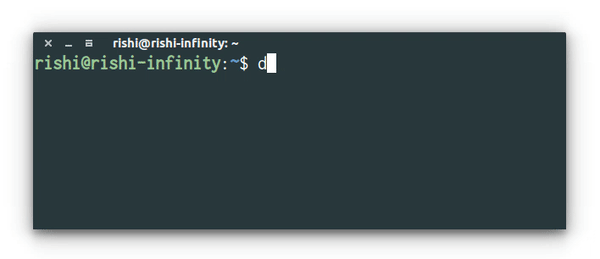

<p align="center">
<br>
	<a href="https://www.npmjs.com/depg"></a>
	<br>
	<br>
	<a href="https://travis-ci.org/CodeDotJS/depg"></a>
	
</p>


<p align="center"><b>Command line tool to find total dependents on a repository!
</b></p>


## Install

```

$ npm install --global depg
```
__`OR`__
```
$ sudo npm install --global depg
```

## Preview

<p align="center">

</p>


## Usage


```
Usage: depg <username/org> <repository>

Example:

 $ depg facebook react

```

## Related

- __[`dep-graph`](https://github.com/CodeDotJS/instavim)__ `:` Packages count that a repository depends on!

## License

MIT - Copyright &copy; [Rishi Giri](http://rishi.ml)
